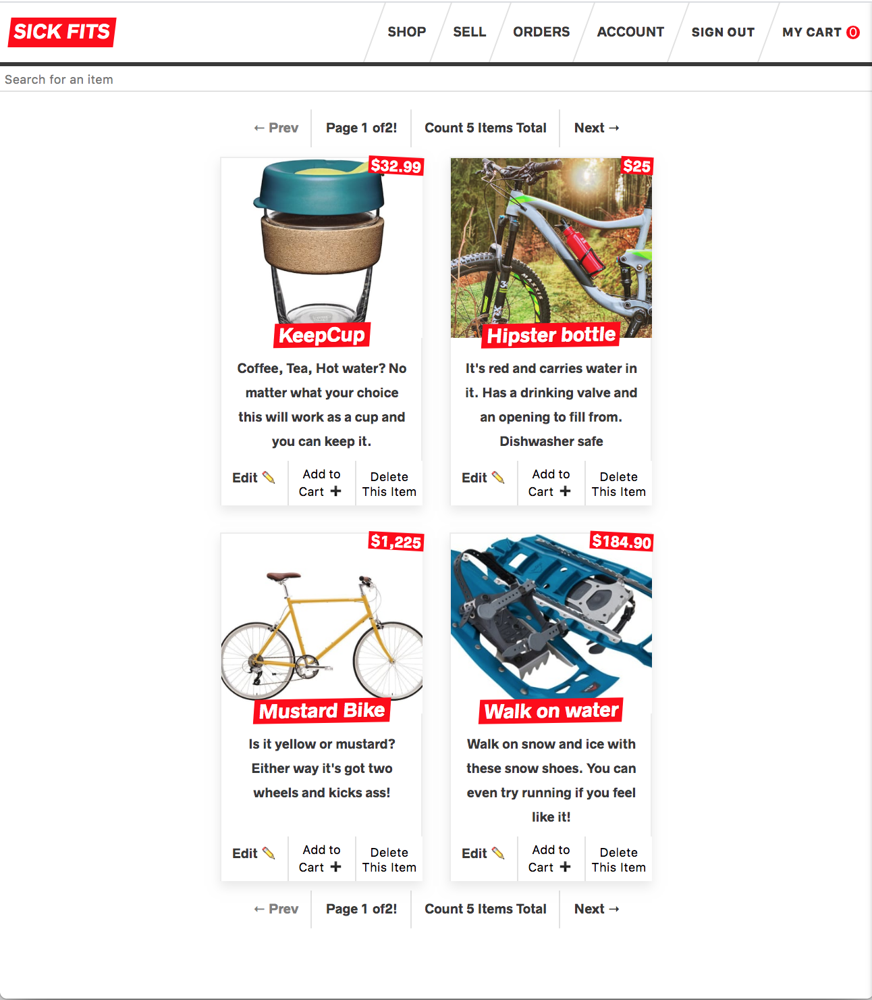
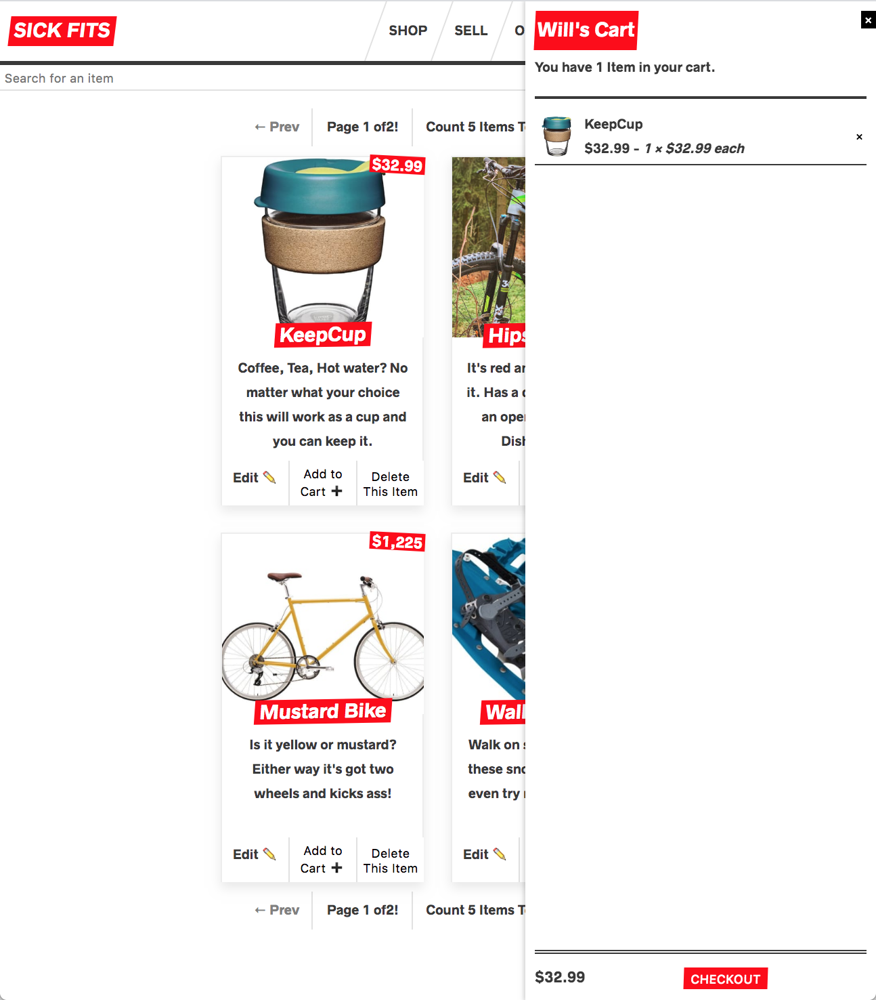

# Advanced React & GraphQL

These are the starter files and stepped solutions for the [Advanced React & GraphQL](https://AdvancedReact.com) course by [Wes Bos](https://WesBos.com/).

Will's Sickfits [demo site is available here]('https://sickfits-reactprod.herokuapp.com')

Complete project folder is ```/sick-fits```

## What is this?

This is a Full stack online store built as a code along to Wes Bos's Advanced React course.
It includes credit card checkout with Stripe. Users can search, sell, add to cart and checkout their favourite items. The application has five main models — Users, Items, Orders, CartItems, and OrderItems — all of which are relational and showcase the power of relational GraphQL Queries.
The app also includes JWT authentication, permissions, sending email, uploading images, and charging credit cards.

## Front end Built using

- Apollo Client for data management
- GraphQL Queries and Mutations
- Jest & Enzyme for Testing
- React, React Apollo
- Styled Components
- Next.js for server-side rendering, routing and tooling

## Back end Built using

- Node, Express Server 
- GraphQL Yoga
- Query and Mutation Resolvers
- Charging Credit Cards with Stripe
- Sending Email
- Performing JWT Authentication
- Handling Permissions
- Self-hosted Prisma as a GraphQL Database Interface
- Prisma for Schema Definition and Data Relationships

## Screenshots of the final product

Store with items:


Showing the checkout:


## Notes

- Run the frontend tests with ```yarn test``` or ```npm test``` from the frontend folder.
- Start the server locally with ```yarn dev`` in each of the /frontend and /backend folders.
- Deploy the backend. (From the top level folder):
  ```git subtree push --prefix sick-fits/backend heroku-backend master```

- Deploy the frontend. (From the top level folder):
  ```git subtree push --prefix sick-fits/frontend heroku-frontend master```
  
## Known Issues
- After adding an item to the store the Cache is not auto-updated. A refresh is required to see that item in the store. This is due to the way Apollo handles mutation.

